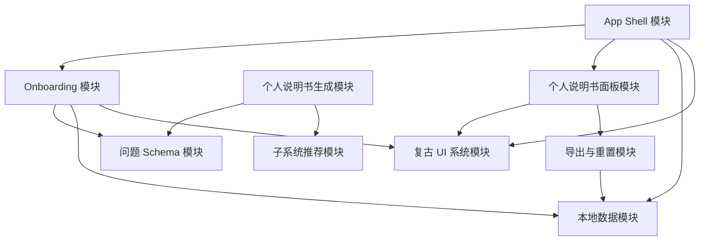

# LifeOS v1.0 设计文档

## 1. 项目定位

LifeOS v1.0 是一个本地优先、开源的网页端 app，用于搭建个人的人生操作系统。

第一版不试图一次性管理人生的所有部分。它的核心目标是帮助用户从“认识自己”开始，通过一个轻量的引导流程，生成一份初始的个人说明书控制面板。

LifeOS v1.0 被设计为一个本地容器，而不是云端 app：

- 用户在自己的设备上运行自己的 LifeOS 实例。
- 个人生活数据存放在用户自己的设备上。
- 默认不向任何云端服务上传个人生活数据。
- v1.0 不包含账号系统、云同步或多人协作。
- v1.0 允许先只服务项目作者本人，作为本地个人项目跑通。
- 开源后，其他用户可以 clone 项目，并运行属于自己的本地 LifeOS。
- v1.0 不是 AI 智能分析 app。系统不通过 AI 推理、心理诊断或黑盒分析来解释用户，而是通过用户回答、规则映射和用户手动编辑来生成个人说明书。

核心原则：

> 默认本地优先。用户拥有自己的数据。个人生活数据不依赖云端。

## 2. v1.0 范围

### 2.1 包含范围

v1.0 包含：

- 复古 Macintosh 风格的网页界面。
- 首次启动引导流程。
- 9 道 onboarding 问题。
- onboarding 回答和生成结果的本地持久化。
- 个人说明书控制面板。
- 完整个人说明书入口。
- 最多推荐 2 个适合优先开启的子系统。
- 个人说明书数据的 JSON 导出。
- 个人说明书数据的 Markdown 导出。
- 清空本地 LifeOS 数据的重置功能。
- 为未来子系统扩展预留的项目结构。

### 2.2 不包含范围

v1.0 不包含：

- 账号系统。
- 云端数据库。
- 云同步。
- 多人协作。
- 完整块编辑器。
- 完整财务记账。
- 完整目标树。
- 完整关系 CRM。
- 复杂 AI 对话。
- AI 智能分析。
- AI 心理诊断。
- 人格诊断。
- 超过 9 题的 onboarding 流程。
- onboarding 阶段的条件追问。

## 3. 产品流程

v1.0 的首次使用路径：

1. 用户在本地打开 LifeOS。
2. 用户看到复古启动界面。
3. 用户进入“建立个人说明书”的引导流程。
4. 用户回答 9 个问题。
5. LifeOS 将回答保存在本地。
6. LifeOS 生成个人说明书控制面板。
7. LifeOS 展示已识别参数、待验证观察和建议开启的子系统。
8. 用户可以打开完整个人说明书。
9. 用户可以导出或重置本地数据。

首次体验应该避免让用户感觉进入了一个复杂的人生管理后台。它应该更像一台属于用户自己的小电脑，正在开始理解用户。

## 4. v1.0 技术决策

v1.0 采用纯本地 Web App 形态，不引入后端服务。

技术选择：

- 前端框架：React。
- 开发语言：TypeScript。
- 构建工具：Vite。
- 本地数据：IndexedDB。
- IndexedDB 封装：Dexie。
- 界面语言：简体中文。
- 未来语言扩展：预留简体中文、繁体中文、English 的语言选择能力。
- 运行目标：先只保证项目作者当前这台 Mac 本地可用。
- 导出格式：JSON 和 Markdown。

选择 React + TypeScript + Vite 的原因：

- v1.0 不需要服务端渲染、云端接口或账号系统。
- Vite 更适合快速搭建纯前端本地应用。
- React 生态成熟，适合开源协作和后续复杂 UI 演进。
- TypeScript 有利于维护模块边界和数据模型。

选择 IndexedDB + Dexie 的原因：

- LifeOS 数据会逐渐从 onboarding 回答扩展到说明书、观察、子系统数据和未来块数据。
- IndexedDB 比 localStorage 更适合结构化本地数据。
- Dexie 能降低直接操作 IndexedDB 的复杂度，并便于测试。

## 5. 语气与交互风格

LifeOS 使用混合语气：

- 50% 旧电脑助手型。
- 30% 冷静工具型。
- 10% 温柔陪伴型。
- 10% 轻度反思引导型。

界面文案可以使用系统感语言，例如：

- 正在读取个人档案...
- 已记录。
- 待验证观察。
- 建议写入个人说明书。
- 来源回答。

产品应避免：

- 临床诊断式语言。
- 过度确定的心理标签。
- 强迫式效率语言。
- 过度未来科技感或科幻感的语言。

## 6. Onboarding 设计

### 6.1 Onboarding 规则

- 题目总数固定为 9 题。
- 第 1-8 题为多选题。
- 每道多选题最少选择 1 个选项，最多选择 3 个选项。
- 第 9 题为短文本题。
- 第 9 题可以跳过。
- onboarding 阶段不追加条件追问。
- 所有生成结论都标记为“待验证观察”。

### 6.2 题目

#### 第 1 题

问题：

> 当你的状态开始下降时，最先失灵的通常是？

选项：

- 注意力
- 行动力
- 睡眠
- 饮食
- 社交耐心
- 消费控制
- 表达能力
- 情绪稳定
- 我说不清

写入：

- 压力信号
- 能量管理系统入口

#### 第 2 题

问题：

> 什么最容易让你恢复一点？

选项：

- 独处
- 睡觉
- 散步
- 整理环境
- 和信任的人说话
- 做具体的小事
- 听音乐或看内容
- 运动
- 暂时断开一切

写入：

- 恢复方式
- 低能量处理方案

#### 第 3 题

问题：

> 你推进事情时，通常更适合哪种节奏？

选项：

- 短时间冲刺
- 稳定日更
- 先想清楚再动手
- 边做边想
- 被外部截止日期推动
- 和别人一起推进
- 灵感来了集中做
- 我还没观察清楚

写入：

- 行动节奏
- 目标系统偏好

#### 第 4 题

问题：

> 别人和你沟通时，哪种方式通常最舒服？

选项：

- 直接说重点
- 先给背景
- 给我时间消化
- 用文字说清楚
- 当面快速同步
- 先确认我的感受
- 给出明确选择
- 不要绕弯

写入：

- 沟通偏好
- 人际关系管理系统入口

#### 第 5 题

问题：

> 当你状态不好时，别人做什么最容易让情况变糟？

选项：

- 催促我
- 反复追问
- 否定我的感受
- 替我做决定
- 讲大道理
- 突然改变计划
- 要求我立刻回应
- 表现得很失望

写入：

- 边界
- 雷区
- 低状态交互说明

#### 第 6 题

问题：

> 如果有人想长期和你合作或相处，他最好先知道什么？

选项：

- 我需要空间
- 我需要明确预期
- 我不擅长即时回应
- 我对承诺很认真
- 我容易想太多
- 我需要被尊重边界
- 我在熟悉后才放松
- 我的表达方式可能和感受不同步

写入：

- 别人如何与我相处
- 关系说明书

#### 第 7 题

问题：

> 最近你最想修复或改善的是哪一块？

选项：

- 作息与精力
- 拖延与行动
- 金钱与消费
- 关系与沟通
- 情绪稳定
- 长期目标
- 自我认知
- 学习与成长
- 生活秩序

写入：

- 建议开启的子系统
- 当前改善方向

#### 第 8 题

问题：

> 你更希望 LifeOS 先帮你变成哪种人？

选项：

- 更稳定的人
- 更清醒的人
- 更有行动力的人
- 更会照顾自己的人
- 更会处理关系的人
- 更自由的人
- 更有创造力的人
- 更有掌控感的人
- 更接近财务目标的人

写入：

- 成长方向
- 目标系统种子
- 与财务相关时，写入财务管理系统入口

#### 第 9 题

问题：

> 有什么是你希望未来的自己不要忘记的？

输入类型：

- 短文本
- 可跳过

提示：

> 可以是一句话、一个提醒、一个底线，或一个你正在努力相信的东西。

写入：

- 个人说明书首页
- 给未来自己的备注

## 7. 生成结果

onboarding 完成后，LifeOS 默认展示个人说明书控制面板，而不是一篇长文档。

### 7.1 控制面板区块

控制面板包含：

1. 自我清晰度
2. 已识别参数
3. 待验证观察
4. 建议开启的子系统
5. 完整个人说明书入口
6. 导出与重置操作

### 7.2 自我清晰度

初始自我清晰度为：

> 朦胧

自我清晰度不是完成百分比。它描述的是系统当前对用户的理解程度。

未来可能的清晰度标签：

- 朦胧
- 初见轮廓
- 趋于清晰
- 高度自洽

v1.0 只要求实现“朦胧”。

### 7.3 已识别参数

已识别参数用于总结 onboarding 回答中的直接信号。

示例：

- 压力信号
- 恢复方式
- 行动节奏
- 沟通偏好
- 边界
- 当前改善方向
- 成长方向

### 7.4 待验证观察

待验证观察由多个回答组合生成。它们不能被呈现为最终真相。

每条待验证观察包含：

- 观察文本
- 来源回答引用
- 状态：待验证

示例：

> 你在压力状态下可能会先失去行动力。

来源：

- 第 1 题：行动力
- 第 3 题：被外部截止日期推动

状态：

- 待验证

### 7.5 建议开启的子系统

LifeOS 在 onboarding 后最多推荐 2 个子系统。

v1.0 可能推荐的子系统：

- 能量管理系统
- 人生目标管理系统
- 人际关系管理系统
- 财务管理系统
- 认知管理系统
- 个人说明书系统

推荐应基于 onboarding 回答。推荐机制需要足够透明，让用户能理解为什么系统建议开启某个子系统。

## 8. 概要设计

LifeOS v1.0 划分为多个相互独立的模块。每个模块只负责明确的职责，并通过清晰接口与其他模块协作。

### 8.1 模块划分

#### App Shell 模块

职责：

- 管理应用整体布局。
- 处理首次启动路由。
- 提供复古桌面式外框。

依赖：

- 本地数据模块
- Onboarding 模块
- 个人说明书面板模块

不应依赖：

- 具体子系统业务逻辑

#### Onboarding 模块

职责：

- 渲染 9 道题流程。
- 校验选择规则。
- 产出结构化 onboarding 回答。

依赖：

- 问题 Schema 模块
- 本地数据模块

输出：

- onboarding 回答记录

不应依赖：

- 个人说明书生成 UI
- 子系统推荐 UI

#### 问题 Schema 模块

职责：

- 定义 9 道问题。
- 定义选项。
- 定义校验规则。
- 定义每个回答写入哪些个人说明书字段。

依赖：

- 不依赖应用运行时状态

输出：

- 静态问题定义

测试要求：

- 可以独立测试。

#### 本地数据模块

职责：

- 在本地存储 LifeOS 数据。
- 读取已有本地数据。
- 重置本地数据。
- 支持 JSON 导出。

依赖：

- v1.0 最终选择的浏览器本地存储技术

输出：

- 已保存的 onboarding 回答
- 已保存的个人说明书档案
- 导出的 JSON

不应依赖：

- UI 组件
- 具体问题渲染

#### 个人说明书生成模块

职责：

- 将 onboarding 回答转换为个人说明书档案。
- 生成已识别参数。
- 生成待验证观察。
- 生成候选子系统推荐。

依赖：

- 问题 Schema 模块
- 子系统推荐模块

输出：

- 个人说明书档案对象

不应依赖：

- UI 组件
- 浏览器存储实现

#### 个人说明书面板模块

职责：

- 展示个人说明书控制面板。
- 展示自我清晰度、已识别参数、待验证观察、建议开启的子系统和完整说明书入口。

依赖：

- 个人说明书档案对象

不应依赖：

- onboarding 问题渲染
- 本地存储内部实现

#### 子系统推荐模块

职责：

- 将 onboarding 回答信号映射为子系统推荐。
- 限制推荐结果最多 2 个。
- 提供推荐来源说明。

依赖：

- 推荐规则

输出：

- 建议开启的子系统列表

测试要求：

- 可以独立测试。

#### 导出与重置模块

职责：

- 将 LifeOS 数据导出为 JSON。
- 在用户确认后清空本地 LifeOS 数据。

依赖：

- 本地数据模块

不应依赖：

- onboarding 流程内部实现

#### 复古 UI 系统模块

职责：

- 提供复古 Macintosh 风格的可复用 UI 组件。
- 提供窗口、按钮、面板、选项组、对话框和系统标签。

依赖：

- v1.0 最终选择的样式系统

不应依赖：

- LifeOS 业务逻辑

### 8.2 模块关系



## 9. 详细设计

### 9.1 App Shell 模块

App Shell 决定用户当前看到什么：

- 如果没有 onboarding 回答，则展示启动界面和 onboarding。
- 如果已经存在 onboarding 回答，则展示个人说明书控制面板。

实现要求：

- 不硬编码问题内容。
- 不包含观察生成逻辑。
- 只负责协调高层流程。

测试用例：

- 没有已保存数据时展示 onboarding。
- 已保存个人说明书档案时展示控制面板。
- 重置后回到首次启动状态。

### 9.2 Onboarding 模块

Onboarding 模块逐题渲染问题。

实现要求：

- 第 1-8 题强制最少选择 1 个，最多选择 3 个。
- 第 9 题允许跳过。
- 用户完成 onboarding 后再持久化回答。
- 回答按 question id 和 selected option ids 结构化保存。

测试用例：

- 第 1-8 题选择 0 个选项时不能继续。
- 第 1-8 题不能选择超过 3 个选项。
- 第 9 题可以跳过。
- 能产出合法回答记录。

### 9.3 问题 Schema 模块

问题 Schema 模块是静态事实来源。

每个问题应包含：

- id
- 标题
- 类型
- 最小选择数量
- 最大选择数量
- 选项
- 写入目标

每个选项应包含：

- id
- 标签
- 信号标签

测试用例：

- 恰好包含 9 道问题。
- 第 1-8 题为多选题。
- 第 1-8 题 min 为 1，max 为 3。
- 第 9 题为可选短文本。
- 每道题内的选项 id 稳定且唯一。

### 9.4 本地数据模块

本地数据模块负责持久化。

v1.0 已确认要求：

- 数据必须保留在用户自己的设备上。
- 不使用云端持久化。

存储方案：

- LifeOS 数据使用 IndexedDB。
- IndexedDB 通过 Dexie 封装。
- 如有需要，轻量 UI 设置可以使用 localStorage。

这是 v1.0 的最终技术决策。

测试用例：

- 本地保存 onboarding 回答。
- 本地读取 onboarding 回答。
- 本地保存生成的个人说明书档案。
- 将已保存数据导出为 JSON。
- 将已保存数据导出为 Markdown。
- 重置已保存的 LifeOS 数据。

### 9.5 个人说明书生成模块

个人说明书生成模块将回答转换为结构化说明书数据。

生成的个人说明书档案应包含：

- selfClarity
- identifiedParameters
- pendingObservations
- suggestedSubsystems
- futureSelfNote
- editableSections

实现要求：

- 观察必须包含来源回答引用。
- 观察必须标记为待验证。
- v1.0 的生成逻辑必须是确定性的。
- v1.0 不使用 AI 生成、AI 推理或 AI 智能分析。
- 用户可以手动编辑完整个人说明书，以修正或覆盖 onboarding 生成的内容。

测试用例：

- 生成的自我清晰度为“朦胧”。
- 能根据回答生成已识别参数。
- 能生成带来源引用的待验证观察。
- 不生成未经支持的诊断标签。
- 不调用 AI 服务。

### 9.6 子系统推荐模块

子系统推荐模块将回答信号映射为子系统建议。

推荐约束：

- 最多返回 2 个子系统推荐。
- 包含推荐来源说明。
- 不强迫用户开启推荐子系统。

初始候选子系统：

- 能量管理系统
- 人生目标管理系统
- 人际关系管理系统
- 财务管理系统
- 认知管理系统
- 个人说明书系统

测试用例：

- 推荐数量不超过 2 个。
- 用户选择金钱相关回答时，能推荐财务管理系统。
- 用户选择沟通或关系相关回答占主导时，能推荐人际关系管理系统。
- 用户选择状态、睡眠、恢复、能量相关回答占主导时，能推荐能量管理系统。
- 每个推荐都包含来源回答引用。

### 9.7 个人说明书面板模块

个人说明书面板模块展示生成结果。

面板区块：

- 自我清晰度
- 已识别参数
- 待验证观察
- 建议开启的子系统
- 完整说明书入口
- 导出与重置操作

实现要求：

- 面板必须易于快速浏览。
- 不能看起来像银行后台。
- 不能一开始就展示所有未来子系统，造成压迫感。
- 应允许用户查看某条观察或推荐的来源。
- 完整个人说明书入口必须可编辑。
- 用户可以修改由 onboarding 生成的说明书内容。

测试用例：

- 渲染全部必要区块。
- 为待验证观察展示来源引用。
- 展示最多 2 个建议子系统。
- 提供导出与重置入口。
- 可以进入可编辑的完整个人说明书。

### 9.8 导出与重置模块

导出要求：

- 将数据导出为 JSON。
- 将数据导出为 Markdown。
- 导出内容包含 onboarding 回答和生成的个人说明书档案。
- 导出不依赖任何云端服务。

重置要求：

- 重置会清空本地 LifeOS 数据。
- 重置必须要求用户明确确认。

测试用例：

- 导出结果是合法 JSON。
- Markdown 导出结果包含个人说明书主要内容。
- 导出内容包含必要顶层字段。
- 重置会清空已保存数据。
- 未确认时不会执行重置。

### 9.9 复古 UI 系统模块

复古 UI 系统模块负责视觉一致性。

视觉方向：

- 类 Macintosh 复古风格。
- 像素感或旧电脑感。
- 略显 outdated。
- 不要未来科技感。
- 不要科幻感。
- 不要现代金融后台感。

可复用组件：

- 启动界面
- 窗口框架
- 面板
- 按钮
- 多选选项组
- 对话框
- 状态标签
- 来源引用展示

测试用例：

- 核心组件可以在不依赖业务逻辑的情况下渲染。
- 多选组件可以通过 props 强制 min 和 max。
- 对话框可以用于重置确认。

## 10. 数据模型草案

### 10.1 Onboarding 回答记录

```ts
type OnboardingAnswerRecord = {
  completedAt: string;
  answers: Array<
    | {
        questionId: string;
        type: "multi-select";
        selectedOptionIds: string[];
      }
    | {
        questionId: string;
        type: "short-text";
        value: string;
        skipped: boolean;
      }
  >;
};
```

### 10.2 个人说明书档案

```ts
type ManualProfile = {
  version: "1.0";
  selfClarity: "hazy";
  identifiedParameters: IdentifiedParameter[];
  pendingObservations: PendingObservation[];
  suggestedSubsystems: SuggestedSubsystem[];
  futureSelfNote?: string;
  editableSections: ManualSection[];
};
```

### 10.3 可编辑说明书章节

```ts
type ManualSection = {
  id: string;
  title: string;
  content: string;
  source: "generated" | "user-edited";
  updatedAt: string;
};
```

### 10.4 已识别参数

```ts
type IdentifiedParameter = {
  id: string;
  label: string;
  values: string[];
  sourceQuestionIds: string[];
};
```

### 10.5 待验证观察

```ts
type PendingObservation = {
  id: string;
  text: string;
  status: "pending";
  sourceAnswerRefs: Array<{
    questionId: string;
    optionId?: string;
  }>;
};
```

### 10.6 建议开启的子系统

```ts
type SuggestedSubsystem = {
  id: string;
  label: string;
  reason: string;
  sourceAnswerRefs: Array<{
    questionId: string;
    optionId?: string;
  }>;
};
```

## 11. 测试策略

每个模块都应尽量可以独立测试。

建议测试层级：

- 问题定义的 Schema 测试。
- onboarding 校验逻辑的单元测试。
- 个人说明书生成逻辑的单元测试。
- 子系统推荐逻辑的单元测试。
- 本地数据导出结构的单元测试。
- 核心 UI 组件测试。
- 首次使用流程的端到端测试。

v1.0 关键验收测试：

1. 新用户可以完成 onboarding。
2. 每道多选题都强制 1-3 个选项。
3. 第 9 题可以跳过。
4. app 能生成个人说明书控制面板。
5. 待验证观察包含来源引用。
6. app 最多推荐 2 个子系统。
7. 刷新后数据仍保存在本地。
8. 用户可以导出 JSON。
9. 用户可以导出 Markdown。
10. 用户可以编辑完整个人说明书。
11. 用户可以重置本地数据。
12. 不需要云端账号或远程数据库。
13. 不调用 AI 服务。

## 12. 已确认决策

以下事项已经确认，并作为 v1.0 实现约束：

1. v1.0 使用 React + TypeScript + Vite。
2. 本地持久化使用 IndexedDB + Dexie。
3. Git 仓库等剩余设计问题确认后再初始化，且初始化任务由另一个聊天窗口处理。
4. v1.0 界面语言使用简体中文。
5. 未来预留简体中文、繁体中文、English 的语言选择能力。
6. v1.0 先只保证项目作者当前这台 Mac 本地可用。
7. v1.0 的完整个人说明书可编辑。
8. v1.0 支持 JSON 和 Markdown 导出。
9. v1.0 不是 AI 智能分析 app，不调用 AI 服务生成结论。
